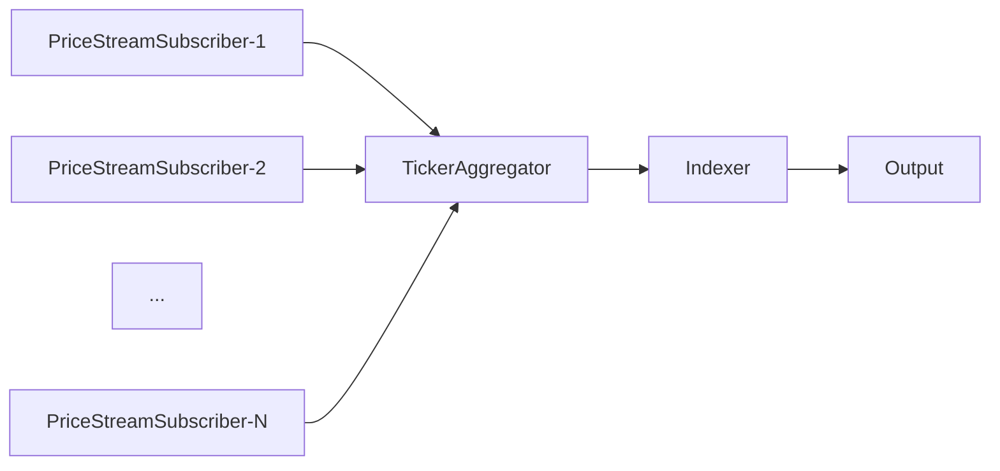

# btcindex-demo
Demo application. Emulates "fair" price calculation of some tickers present on several stock/crypto-exchanges.

## Structure

## Data flow

### PriceStreamer 
*Path: internal/pricestreamer*

Entities & base interface, basic-enough for different stock/crypto-exchange clients to support. `context.Context` was added to method `SubscribePriceStream(...)`.

### TickerAggregator
*Path: internal/aggregator*

Container for PriceStreamSubscribers, very simple interface for the on-the-fly PriceStreamSubscriber appending, attempts to re-subscribe on errors.
Multiplexes PriceStream's data to a single output channel. `Quote` struct is used to wrap provided data with Timestamp & source info, decimal presentation is used for prices.

### Indexer
*Path: internal/indexer*

Consumes `Quote`s outputed by Aggregator, invokes some algorithm to calculate "fair" price based on data provided, outputs calculated index every solid minute. Any algorithm implementing `algorithm.Formula` interface can be used.

I did "streaming" mean (recurrent calculation based on previously calculated mean). Good algorithm for "fair" price calculation forms business-value of this application, but from the technical standpoint - it's not the most challenging part - so, it's just an example.

## Issues (cut corners):

* Different providers may have significantly different "velocity". For example, `PriceStreamSubscriber-1` provides TickerPrice on per-milisecond basis, `PriceStreamSubscriber-2` - outputs every other second. `TickerAggregator` single output channel can be overfilled with data from the 1st provider and this will affect all other PriceStreamSubscribers. There are several paths to mitigate this: "multi-threaded indexer" or maybe "re-sampling" for each `PriceStreamSubscriber`.
* Logging. Application seriously lacks log output of errors / warnings.
* Unit-tests.
